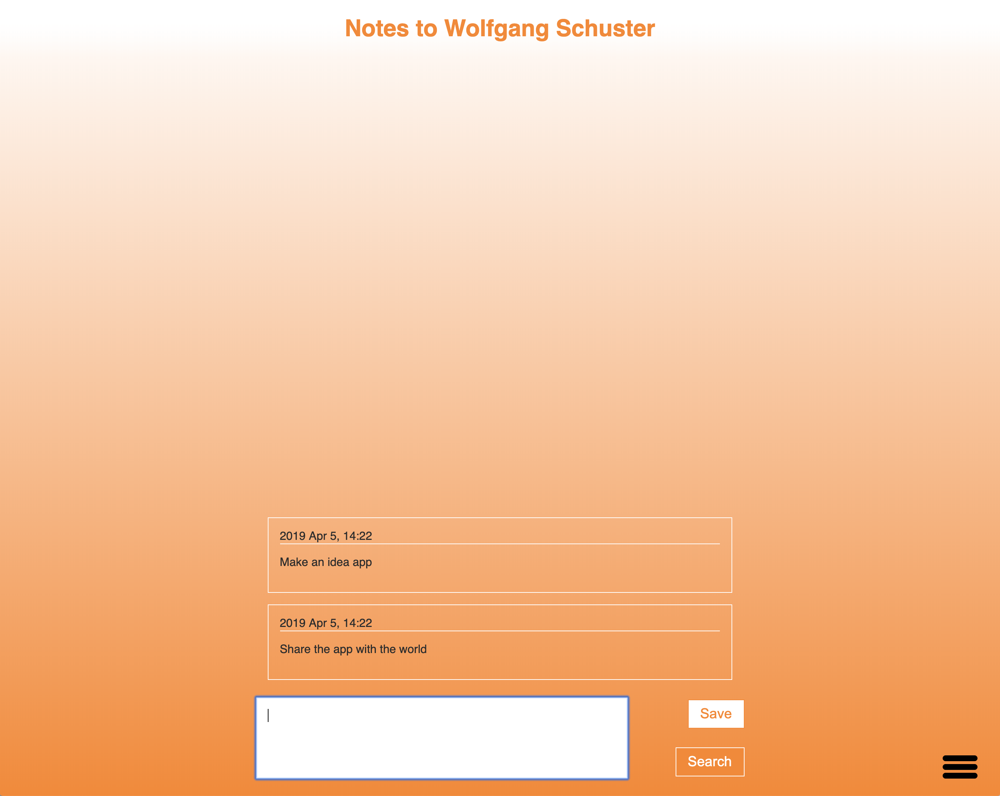

# Notes to Self

A super simple app for storing your thoughts and ideas. Just jot them down and hit sav, or Ctrl + Enter, and your thought is saved. Thoughts are also saved after 5 min of no editing. [Try it today!](https://notes-to-self-cea55.firebaseapp.com/)

This _**isn't**_ a todo app, the only way to get rid of a thought is to purge **all** of them! However it is easy to purge all thoughts if you decide you no longer want to keep them around.

